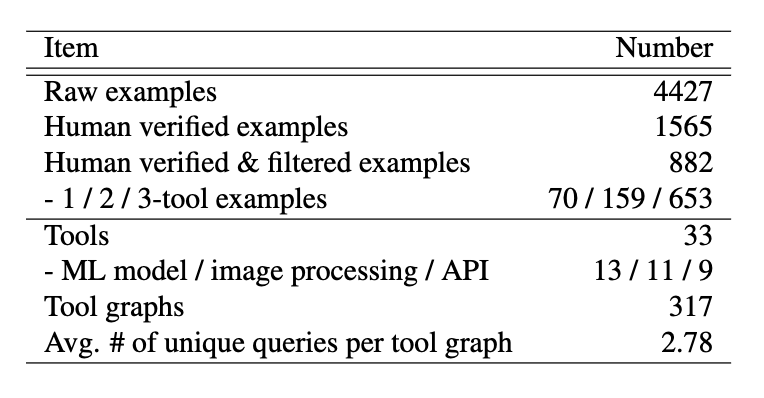
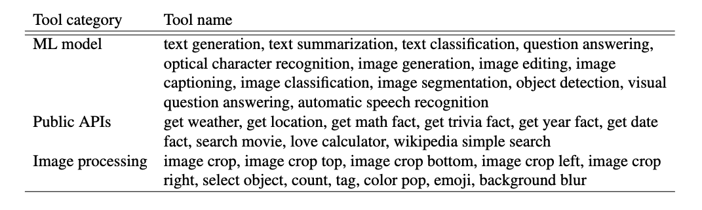
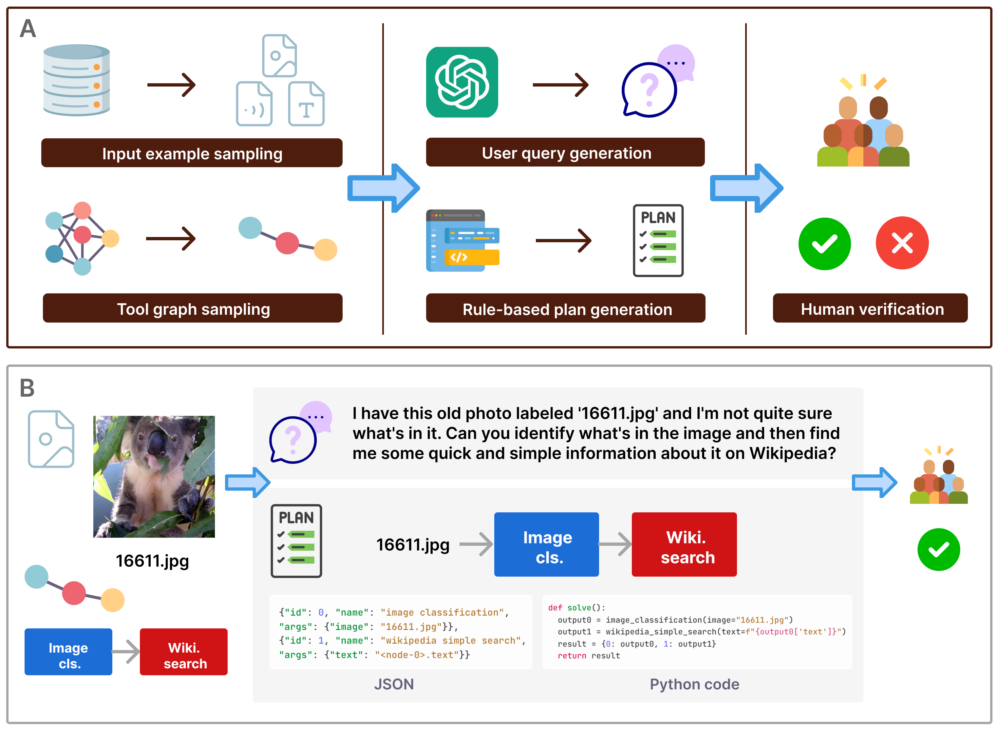

# m&m's: A Benchmark to Evaluate Tool-Use Agents for multi-step multi-modal Tasks
[**🌐 Website**](https://mnms-project.github.io/) | [**🤗 Dataset**](https://huggingface.co/datasets/zixianma/mms) | [**📖 Paper**](https://arxiv.org/abs/2403.11085) 

m&ms is a benchmark for evaluating large language model (LLM) agents' tool-use abilities on multi-step multi-modal tasks.

## Dataset examples


## Dataset details
This dataset contains 4K+ multi-step multi-modal tasks involving 33 tools that include 13 multi-modal models, 9 (free) public APIs, and 11 image processing modules. For each of these task queries, we provide automatically generated plans using this realistic toolset. We further provide a high-quality subset of 1,565 human-verified task plans and 882 human-verified, filtered, and correctly executable plans. Below is a table summarizing the statistics of m&ms:
<p align="center">
  
</p>
And a table listing all 33 available tools in our tool API:
<p align="center">
  
</p>


## Dataset generation
<p align="center">
  
</p>

## Setup
### Installation
Please make sure you install all the required packages in ```requirements.txt``` by running:
```
pip install -r requirements.txt
```
### Environment variables
You can set up your environment variables by running the command lines below line by line or store them locally in a file (e.g. ```.bashrc```)
```
export HUGGINGFACE_HUB_CACHE=<your_cache_dir>
export RAPID_API_KEY=<your_rapid_key>
export OMDB_API_KEY=<your_omdb_key>
export OPENAI_API_KEY=<your_openai_key> 
export GOOGLE_API_KEY=<your_google_key> (only if you experiment with Google's models)
export DEEPINFRA_API_KEY=<your_deepinfra_key> (only if you run models hosted on DeepInfra)
```
And then run this line for the changes to take effect:
```
source .bashrc
```
You can generate your own API keys on [Rapid](https://rapidapi.com/), [OMDb](https://www.omdbapi.com/), [OpenAI](https://openai.com/), [Google](https://ai.google.dev/tutorials/quickstart), and [DeepInfra](https://deepinfra.com/).

## Planning
To run planning experiments on m&ms with LLM agents, below is an example command line
```
python -m mnms.run_plan_agent  --action-format json --plan-mode multi-step --model gemini-pro --max-reply 10 --verify --execute --exp-id 0331 
```
where the arguments:
- ```action-format``` specifies the output format of the LLM agent i.e. ```json``` or ```code```;
- ```plan-mode``` refers to the planning strategy ```multi-step``` or ```step-by-step```;
- ```max-reply``` is the max number of turns the LLM agent can take to refine its initial plan (```max-reply=0``` means no iterative refinement);
- ```verifiy``` and ```execute``` specify whether to turn on verification and execution feedback during planning.

Additionally, you can also run experiments on your own queries by adding ```--input-file <your_input_file>```, where each example is expected to contain ```id``` and ```user_request```.


## Evaluation
To evaluate the predicted plans against the groundtruth plans in m&ms, simply run this line:
```
python -m mnms.evaluation.run --plan-format json --preds-file <predictions.json> --output-csv <output.csv> 
```
Note that our code works with a ```predictions.json``` file where each line is a dictionary containing "id" and "prediction" like the example below:
```
{"id": 10, "prediction": [{"id": 0, "name": "text classification", "args": {"text": "forced, familiar and thoroughly condescending."}}]}
{"id": 24, "prediction": [{"id": 0, "name": "text generation", "args": {"text": "Who exactly became the King of the Canary Islands?"}}]}
...
```

But you are welcome to modify it to work with other file formats. 

## Execution

To execute the groundtruth plans, you can run this line:
```
python -m mnms.execution.run --plan-format code
```


To execute predicted plans, you will need to additionally provide a ```predictions.json``` file like this:
```
python -m mnms.execution.run --plan-format json --input-file <predictions.json>
```

## Citation
If you find our work helpful, please consider starring our repo or citing our paper. Thanks!
```
@article{ma2024mms,
  title={m&m's: A Benchmark to Evaluate Tool-Use for multi-step multi-modal Tasks}, 
  author={Zixian Ma and Weikai Huang and Jieyu Zhang and Tanmay Gupta and Ranjay Krishna},
  year={2024},
  journal={arXiv preprint arXiv:2403.11085},
}
```
